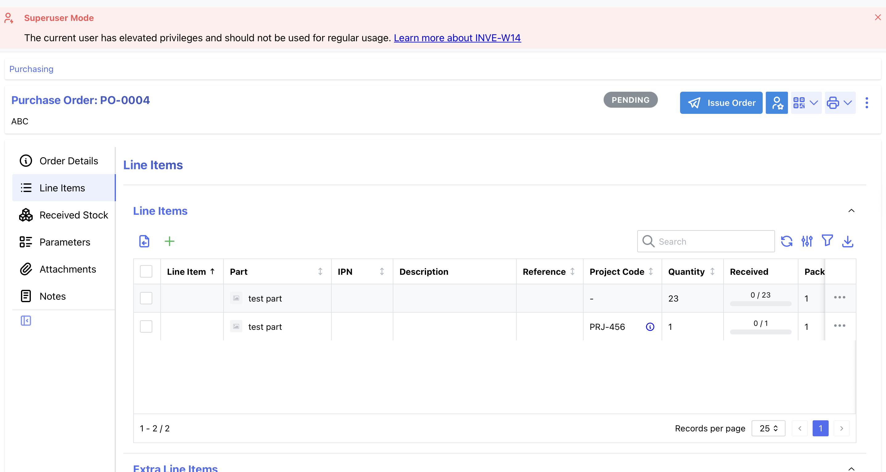

# Contribution: PO: parts with different project codes get merged into single line #10947

**Contribution Number:** 1

**Student:** Yuting
**Issue:** [issue link](https://github.com/issues/recent?issue=inventree%7CInvenTree%7C10947)
**Status:** [**Phase I** / **Phase II** / **Phase III** / Phase IV] [In Progress / **Complete**]

---

## Why I Chose This Issue
This issue is simple and good for new contributors. It repo is mainly Python, the language I'm familiar enough.

---

## Understanding the Issue

### Problem Description
The "Add Line Item" form in Purchase Orders includes a "Merge Items" checkbox, which is currently hardcoded to True by default. When enabled, adding a line item for a part that already exists in the PO will merge it into the existing line — including overwriting the project code. There is no system-level setting to change this default behavior.

### Current Behavior
The "Merge Items" checkbox in the PO line item form always defaults to True. Users who need items with different project codes to remain as separate lines must manually uncheck "Merge Items" every time they add a line item, with no way to configure a different default.

### Expected Behavior
A configurable setting should be added to the system settings that controls the default state of the "Merge Items" checkbox — allowing administrators to set it to False by default for instances where per project-code tracking is important.

### Affected Components
- PO "Add Line Item" form — Merge Items checkbox default value
- System settings — new configurable toggle for the above default
---

## Reproduction Process

### Environment Setup

Set up a Docker production server following the official installation guide 
(https://docs.inventree.org/en/latest/start/docker_install/), running InvenTree v1.3.5.

Prerequisites that need to be created before reproducing:
- At least one Part
- At least one Supplier with a Supplier Part linked to the above Part
- At least two Project Codes (Settings → Project Codes)

### Steps to Reproduce

1. Create a new Purchase Order with a Supplier
2. Add a line item: select the Supplier Part, assign Project Code #1, submit
3. Add another line item: select the **same** Supplier Part, assign Project Code #2, submit
4. Observe that the two line items are merged into one, retaining only Project Code #1

### Reproduction Evidence

- **Screenshots/logs:** 
- **My findings:** 
  - When "Merge Items" is checked (default): adding the same part twice merges the lines into one, and the second project code is silently discarded
  - When "Merge Items" is unchecked: both line items are kept as separate lines, each retaining their own project code — this is the expected behavior
  - If the PO itself has a project code assigned, it does not affect the per-line-item project code behavior described above
---

## Solution Approach

### Analysis
The "Merge Items" checkbox in the PO "Add Line Item" form has two hardcoded True defaults:

1. order/serializers.py:738 — default=True on the merge_items BooleanField
2. order/api.py:688 — data.get('merge_items', True) safety fallback

The merge logic (api.py:689-694) compares part, order, target_date, destination — but NOT project_code. So two items with different project
codes for the same part/order/date/destination always merge, silently discarding the second project code.

The frontend (PurchaseOrderForms.tsx:223-225) renders the checkbox with an empty field spec {}, which means the backend serializer's default
drives the initial checkbox state.

### Proposed Solution

Add a PURCHASEORDER_MERGE_ITEMS_DEFAULT global setting (default: True to preserve current behavior). Wire it as the default in both the
 serializer and the api fallback. In the frontend, read it via globalSettings.isSet(...) to pre-populate the checkbox.

### Implementation Plan

Using UMPIRE framework (adapted):

**Understand:** The "Merge Items" checkbox in the PO "Add Line Item" form always defaults to checked (True), with no system-level way to change that default.
 Items with different project codes for the same part get silently merged. A configurable global setting should control the checkbox default.

**Match:** 
- Settings pattern: existing PURCHASEORDER booleans in common/setting/system.py (e.g., PURCHASEORDER_AUTO_COMPLETE at line ~983).
- Backend setting read: get_global_setting(key, backup_value=...) — already imported in serializers.py (line 22) and available as
common.settings.get_global_setting in api.py (line 28).
- Frontend setting read: globalSettings.isSet('SETTING_KEY') pattern from PartForms.tsx:74-104. globalSettings is already available in
usePurchaseOrderLineItemFields() at PurchaseOrderForms.tsx:75.

**Plan:** [Step-by-step implementation plan]
 1. src/backend/InvenTree/common/setting/system.py — add after PURCHASEORDER_AUTO_COMPLETE (~line 983)
 2. src/backend/InvenTree/order/serializers.py:738 — replace hardcoded default=True with
 3. src/backend/InvenTree/order/api.py:688 — replace hardcoded True fallback
 4. src/frontend/src/forms/PurchaseOrderForms.tsx:224 — replace empty
 5. Tests — add to src/backend/InvenTree/order/test_api.py

**Implement:** [Link](https://github.com/YutingDuan111/InvenTree/tree/fix-issue-10947) commit dc7931688cde400aa59a3cfcd7283d4f27609250

**Review:** 
 - [ ] All user-visible strings use _('...') (gettext_lazy)
 - [ ] Setting key follows PURCHASEORDER_* naming convention
 - [ ] Pre-commit hooks run (invoke dev.setup-dev)
 - [ ] No migration needed — adding a global setting key only adds a row to the existing settings table when first accessed; it does NOT alter
 database schema

**Evaluate:** 
 - Unit tests pass: invoke dev.test --runtest order
 - Manual: set PURCHASEORDER_MERGE_ITEMS_DEFAULT=False in system settings → open "Add Line Item" → verify checkbox is unchecked by default
 - Manual: set to True → verify checkbox is checked by default (existing behavior unchanged)

---

## Testing Strategy

### Unit Tests

- [ ] Test case 1: [Description]
- [ ] Test case 2: [Description]
- [ ] Test case 3: [Description]

### Integration Tests

- [ ] Integration scenario 1
- [ ] Integration scenario 2

### Manual Testing

[What you tested manually and results]

---

## Implementation Notes

### Week [X] Progress

[What you built this week, challenges faced, decisions made]

### Week [Y] Progress

[Continue documenting as you work]

### Code Changes

- **Files modified:** [List]
- **Key commits:** [Links to important commits]
- **Approach decisions:** [Why you chose certain approaches]

---

## Pull Request

**PR Link:** [GitHub PR URL when submitted]

**PR Description:** [Draft or final PR description - much of the content above can be adapted]

**Maintainer Feedback:**
- [Date]: [Summary of feedback received]
- [Date]: [How you addressed it]

**Status:** [Awaiting review / Iterating / Approved / Merged]

---

## Learnings & Reflections

### Technical Skills Gained

[What you learned technically]

### Challenges Overcome

[What was hard and how you solved it]

### What I'd Do Differently Next Time

[Reflection on your process]

---

## Resources Used

- [Link to helpful documentation]
- [Tutorial or Stack Overflow post that helped]
- [GitHub issues or discussions that helped]
